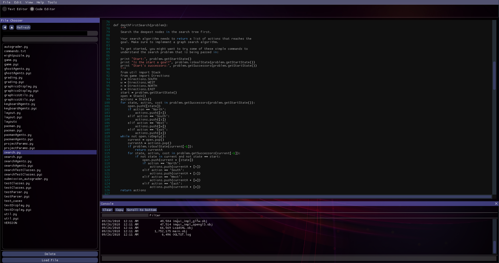
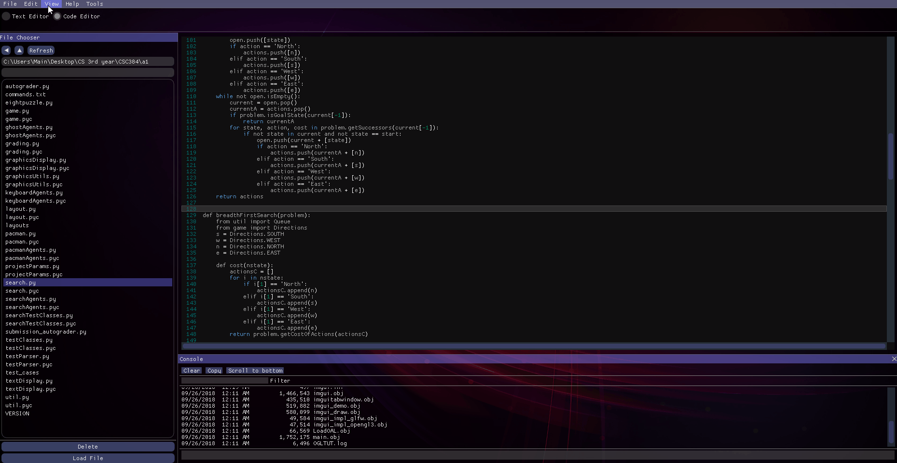
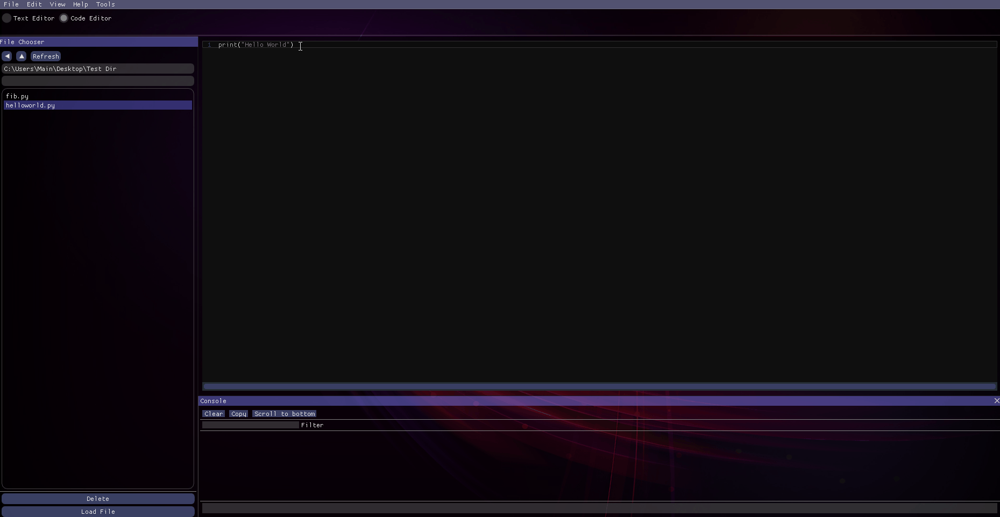
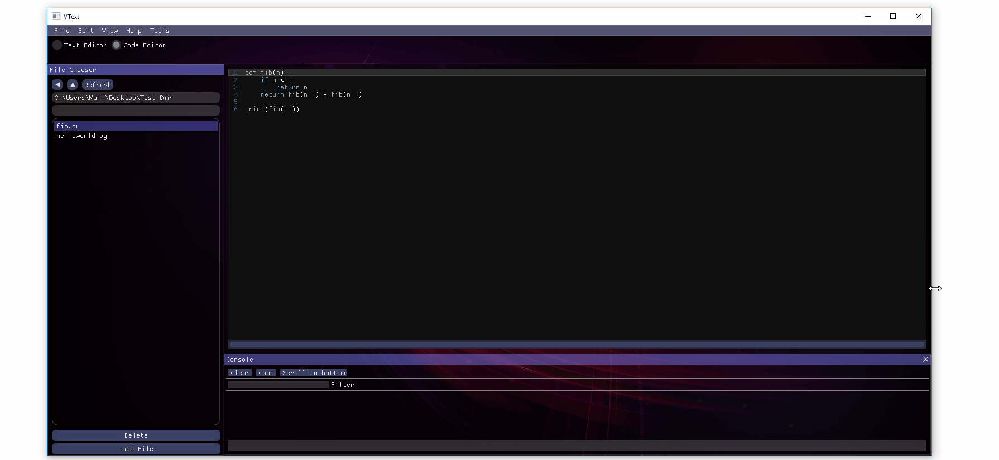

# VText

VText is a Windows text/Code editor made entirely from C++, GLSL, GLFW, openGL, and [Imgui](https://github.com/ocornut/imgui). VText allows the user to create file/directories, edit new and old files, and run python files. VText also uses runs Windows Command Prompt commands and displays the output in the text editor itself.

# Usage
Download the VText folder and run the VText.exe

# Additional Details
* Saves state of text editor when exiting the program and reloads state up startup. 
* Python files can be compiled and run.
* Command Line output is displayed to the user.
* [Imgui](https://github.com/ocornut/imgui) most of features regarding GUI. The File Chooser, Text View, and Layout were created from ground up for the purpose of this project (the code can be found in imgui_tools.h).
* Graphics Engine is created from scratch using C++, OpenGL, GLSL, GLFW, and various other libraries.
* Can switch between text or code editor.

# Future development
* Create easy way to compile and run Java, C, C++ and various other languages.
* Ability to create more Text views via tabs.
* Ability to analyze information of a particular file.
* Multiplatform integration.

# Graphics Engine
for more information regarding the graphics engine: [OpenGL-Graphics-Engine](https://github.com/vinaykomaravolu/OpenGL-Graphics-Engine).

# Tools used in the Project:
* OpenGL
* ImGui
* GLFW
* GLSL
* C++

# Demonstration

## File Chooser

## Layout

## Compiling/Runnin Python Fil

## Resizing

